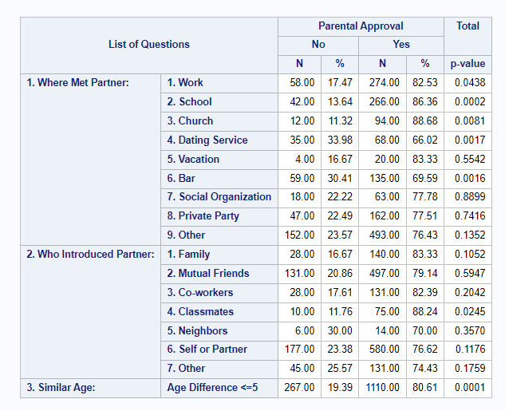

# Exploring_SAS

## Description: 
this repo aims to explore the capabilities of SAS and applications in the industry.
 - proc steps and data steps
 - Format data for interpretability and requirements from customer
 - Understand the pros and cons of longitudinal and cross-sectional data
 - Visualize and tabulate with proc freq, proc mean and proc tabulate
 - Explore macro usage, synthax and grammer
 - Utilize macro in producing reports

An automated report generation SAS macro was created for potential FDA reporting.

A list of fixed questions is asked about a specific interest topic (user supplied) like parental approval in this case.

Summary statistics will be produced based on that topic with p-value of relevent test of significance.
